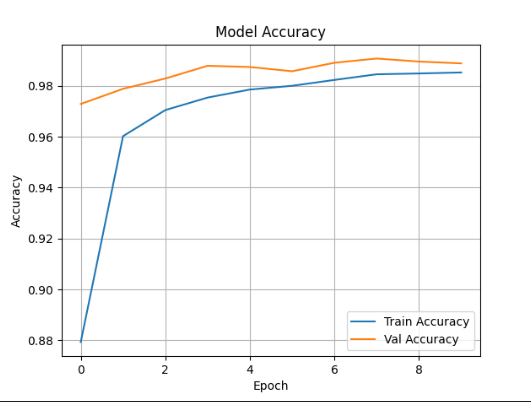

# Handwritten Digit Recognition

This project is a machine learning model to classify handwritten digits using the MNIST dataset. It uses Convolutional Neural Networks (CNN) to achieve high accuracy in digit recognition.


## 技术栈

- **Python 3.x**: Programming language used for development.
- **TensorFlow/Keras**: Framework for building and training deep learning models.
- **Pandas**: Data manipulation library used to load and process the MNIST dataset.
- **Matplotlib**: Library used to plot training and validation accuracy graphs.
- **Scikit-learn**: For additional machine learning utilities.


## 功能截图

### 预测结果截图



## 安装与部署说明

### 安装依赖

###1. 克隆项目到本地：

   ```bash
   git clone https://github.com/wdk723/handwritten-digit-recognition.git

###2.进入项目目录：

cd handwritten-digit-recognition


###3。创建并激活虚拟环境：

python -m venv venv
venv\Scripts\activate  # Windows
source venv/bin/activate  # Linux/macOS


###4.安装项目依赖：
pip install -r requirements.txt


###运行项目
1.运行 main.py 文件：
python main.py


2.训练完成后，模型将会输出训练和验证的准确率，并且会保存训练好的模型。


- **安装步骤**：给出项目所需依赖的安装步骤（如虚拟环境设置、依赖包安装）。
- **运行项目**：指导用户如何启动项目并查看结果。

#### 2.5 使用说明

描述如何使用项目的功能。比如，如何训练模型，如何使用训练好的模型进行预测等。

```markdown
## 使用说明

1. **训练模型**：在项目根目录下运行 `main.py` 文件，模型将开始训练。
   
   ```bash
   python main.py


2.模型预测：训练完成后，你可以使用训练好的模型来进行手写数字的预测。


- **训练模型**：解释如何启动训练。
- **模型预测**：说明如何使用训练后的模型进行实际预测。

#### 2.6 贡献说明

如果项目是开源的，说明如何贡献代码，如何向项目提交 pull request。

```markdown
## 贡献

欢迎贡献代码，以下是贡献的步骤：

1. Fork 本仓库。
2. 创建一个新的分支：`git checkout -b feature-name`。
3. 提交你的更改：`git commit -m 'Add feature'`。
4. 推送到分支：`git push origin feature-name`。
5. 创建一个 Pull Request。


##许可证
此项目采用 MIT 许可证，详细信息请参阅 LICENSE 文件。

csharp


### 4. 提交 README 文件

完成 README 文件后，记得提交并推送到 GitHub：

```bash
git add README.md
git commit -m "Add README with project details"
git push origin master
